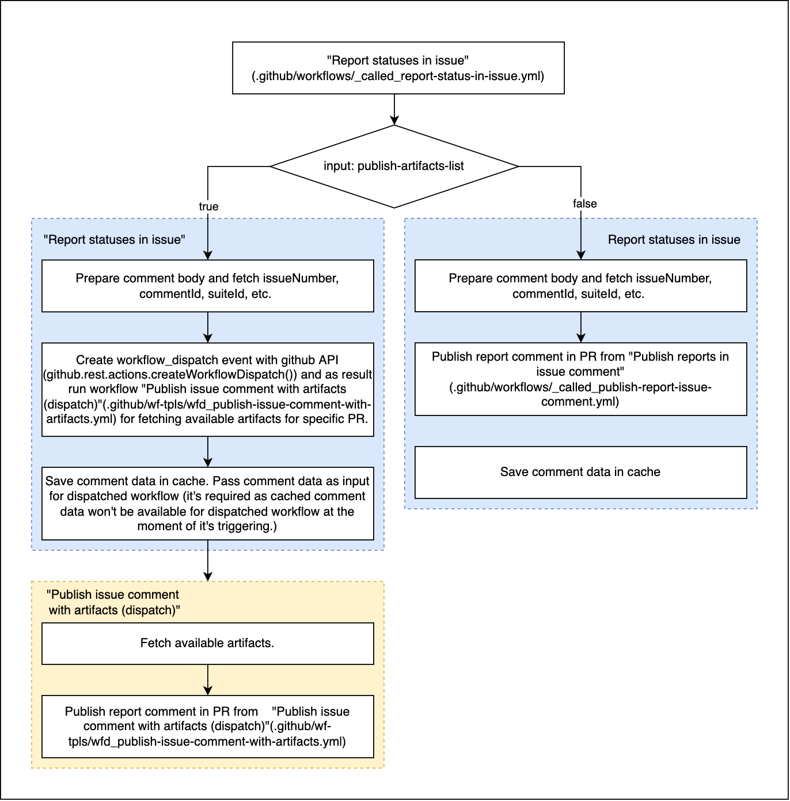
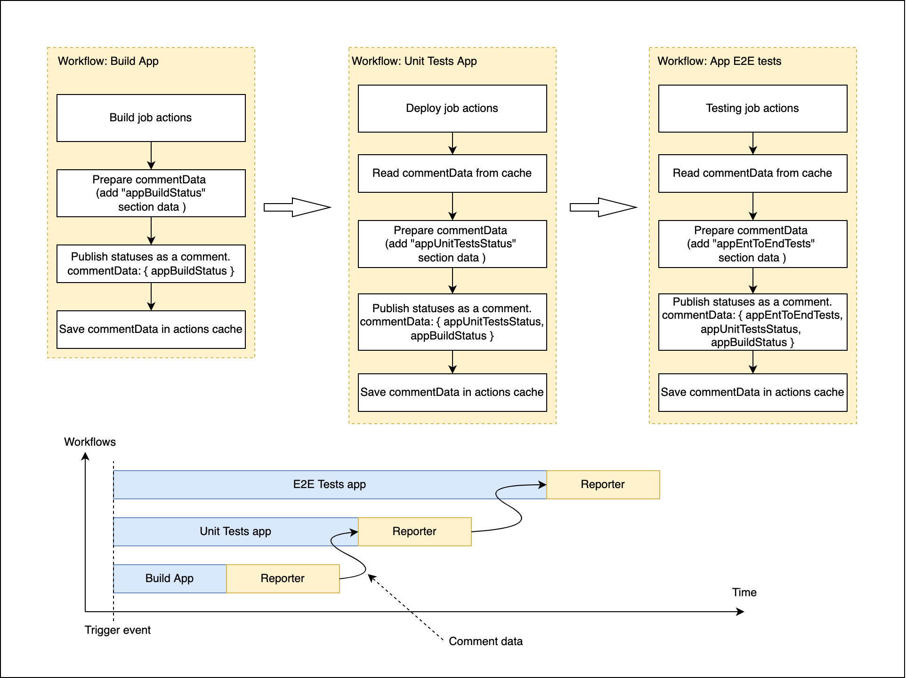

# Basilisk UI CI/CD

Basilisk-UI GitHub Actions are configured with using ["Reusing workflows"](https://docs.github.com/en/actions/using-workflows/reusing-workflows)
and [GitHub Script](https://github.com/actions/github-script).
We have caller workflows which are configured for specific purposes with different 
trigger events (`pull_request`, `push`) and reusable modules/workflows which can be reused in different 
combinations/sequence in caller workflow. 

<details>
<summary><i>Short info about Reusable workflows</i></summary>
A workflow that uses another workflow is referred to as a "caller" workflow. The reusable workflow is a 
"called" workflow. One caller workflow can use multiple called workflows. Each called workflow is 
referenced in a single line. The result is that the caller workflow file may contain just a few lines of 
YAML, but may perform a large number of tasks when it's run. When you reuse a workflow, the entire called 
workflow is used, just as if it was part of the caller workflow.
</details>

---

### Used actions/libraries
- [GitHub Script](https://github.com/actions/github-script) - run JavaScript logic in GitHub Actions.
- [Discord for GitHub Actions](https://github.com/Ilshidur/action-discord) - publication messages to Discord channels.
- [code-coverage-action](https://github.com/barecheck/code-coverage-action) - generate/publish testing code coverage reports to PR.


### Files naming/structure convention
- __caller workflow file__ - (`.github/workflows/wf_*.yml`) has prefix `wf_`. Consists of reusable 
  workflow calls in different combinations regarding purposes. Should not contain any functionality for 
  building, testing, deployment, etc., only calls of called workflows.
- __dispatched workflow__ - (`.github/workflows/wfd_*.yml`) has prefix `wfd_`. Workflow which is triggering after dispatch event,
  which is created manually or from another workflow via GitHub API. More details [here](https://docs.github.com/en/rest/reference/actions#create-a-workflow-dispatch-event).
_**IMPORTANT** - All updates in such workflow file and related github-script files will be applied only if they pushed 
into default repository branch (`main | develop`)._
- __called workflow file__ - (`.github/workflows/_called_*.yml`) has prefix `_called_`. Contains 
  functionality for specific purpose (application build, unit testing, etc.). Should contain independent piece of full
  workflow, generate artifacts for next steps, publish reports, etc.
- __github-scripts sources__ - (`./scripts/ci/github-script-src/**/*.js`) contains JavaScript logic for GitHub Script action.

---

## Configured root workflows

#### :file_folder: Build Deploy App and Storybook
```yaml
on:
  push:
    branches:
      - 'fix/**'
      - 'feat/**'
      - develop
  pull_request:
    types:
      - opened
    branches:
      - develop
```
Jobs:
- Build App and Storybook (`build-app-storybook`);
- Deploy App&Storybook builds (`deploy-app-storybook-builds`);
- Report PR comment (`report-statuses-pr-comment`);


#### :file_folder: App E2E testing
```yaml
on:
  push:
    branches:
      - 'fix/**'
      - 'feat/**'
```
Jobs:
- Build App and Storybook (`build-app-storybook`);
- Run App e2e tests (`app-e2e-tests`);


#### :file_folder: App Unit testing
```yaml
push:
  branches:
    - 'fix/**'
    - 'feat/**'
    - develop
  pull_request:
    types:
      - opened
    branches:
      - develop
```
Jobs:
- Testing (`testing`);

---

## Existing reusing workflows

#### :chains:  Build App and Storybook ([.github/workflows/_called_build.yml](/.github/workflows/_called_build.yml))
Build application and storybook. Results are saved as artifacts with passed names.

:inbox_tray: ***Inputs***:
- `app-build-artifact-name`: _String, required_
- `storybook-build-artifact-name`: _String, required_
- `app-node-modules-cache-key`: _String, required_

:outbox_tray: ***Outputs***: -//-

:bricks: ***Artifacts***: Application and Storybook builds with names `app-build-artifact-name` and `storybook-build-artifact-name` 

:lock: ***Secrets***: -//-

<hr />

#### :chains:  Deploy App and Storybook ([.github/workflows/_called_deploy.yml](/.github/workflows/_called_deploy.yml))
Deploy application and storybook to github pages.


This workflow is configured for deployment of UI application and Storybooks
at the same time. Each branch `develop|feat|fix/**` deploys to appropriate folder in `app-builds-gh-pages` branch.
Branch folder contains 2 sub-folders: `app` and `storybook` for UI app and Storybook builds
accordingly.

App UI builds and Storybooks are hosted in GitHub Pages.

For access to the builds you can use these paths:

- **UI app** - `https://galacticcouncil.github.io/Basilisk-ui/<folder_name>/<subfolder_name?>/app`
- **Storybook build** - `https://galacticcouncil.github.io/Basilisk-ui/<folder_name>/<subfolder_name?>/storybook`

:inbox_tray: ***Inputs***:
- `app-build-artifact-name`: _String, required_
- `storybook-build-artifact-name`: _String, required_

:outbox_tray: ***Outputs***: -//-

:bricks: ***Artifacts***: -//-

:lock: ***Secrets***: 
- `gh_token`: _required_
- `gh_pages_full_branch`: _required_ - name of branch for saving deployed builds.

<hr />

#### :chains:  Run unit tests on UI app ([.github/workflows/_called_run-unit-tests-app.yml](/.github/workflows/_called_run-unit-tests-app.yml))
Run unit tests in UI application. If trigger event is `pull_request`, workflow builds/tests target branch as well.
Reports can be used in `Publish reports in PR and Discord` workflow for generating code coverage difference value.

:inbox_tray: ***Inputs***:
- `base-branch-codecov-artifact-name`: _String, required_
- `working-branch-codecov-artifact-name`: _String, required_
- `app-node-modules-cache-key`: _String, required_

:outbox_tray: ***Outputs***: -//-

:bricks: ***Artifacts***: Tests code coverage reports (`lcov.info`)with names  
`base-branch-codecov-artifact-name` and `working-branch-codecov-artifact-name`

:lock: ***Secrets***: -//-

<hr />

#### :chains:  Generate tests code coverage reports ([.github/workflows/_called_generate-unit-tests-code-cov-report.yml](/.github/workflows/_called_generate-unit-tests-code-cov-report.yml))
Generate unit tests code coverage report from report files, which must be provided as artifacts and names of artifacts as 
workflow inputs.

:inbox_tray: ***Inputs***:
- `base-branch-codecov-artifact-name`: **String, required** - _artifact name with code-coverage report from PR target branch_
- `working-branch-codecov-artifact-name`: **String, required** - _artifact name with code-coverage report from working target branch_

:outbox_tray: ***Outputs***: 
- `codecov_unit_percentage`: _Total Percentage coverage_
- `codecov_unit_diff`: _Percentage difference between head branch_

:bricks: ***Artifacts***: -//-

:lock: ***Secrets***:
- `barecheck_github_app_token`: _required_

<hr />

### :chains:  Report status in PR ([.github/workflows/_called_report-status-in-pr.yml](/.github/workflows/_called_report-status-in-pr.yml))
Publish statuses and reports from different steps of caller workflow as comment in related PR. Workflow is based on libraries
`GitHub Script`. 

#### Artifacts
If we need fetch available artifacts, so it can be done only in separate/next workflow after workflow 
which generates these artifacts. Artifacts are not visible for API before run is completed. More details in 
[this](https://github.com/actions/upload-artifact/issues/50) issue. If `publish-artifacts-list == true`, current called 
workflow generates dispatch event for workflow, which can fetch artifacts from current workflow run.

As result `Report status in PR` workflow has logic, explained in diagram below:



Report status workflow can collect statuses from different workflows and publish them in one single comment.
This is possible through the usage of actions caching feature (`actions/cache@v2`). Each `push` or `pull_request` events can 
trigger multiple workflows, which contains `Report status in PR` job (_called workflow_). If trigger commit is related
with some open pull request or trigger event is [pull_rerquest:opened](https://docs.github.com/en/actions/using-workflows/events-that-trigger-workflows#pull_request),
each run will publish it's statuses/artifacts as comment in appropriate Pull Request post. If comment is already existing,
reporter from each caller workflow will update existing comment by it's own status and republish statuses from other 
workflow runs. It's possible though cached comment data (stringified JSON saved in the file) from each reporter, which 
has been triggered buy the same event. Each reported fetches cached data from reporter job of previously finished 
workflow run, extends cached data by it's own and uses extended data for comment publication.
This provides inheritance of comment data between workflows.

`actions/cache@v2` can read files from GitHub cache. Also, if `key` parameter is unique in the repo, file in 
`path` location will be added into cache after successful completion of the job. Each reporter generates it's own cache
with key by next pattern - `reporter-artifacts-branch-${{ github.ref_name }}-commit-${{ github.sha }}-${{ steps.timestamp.outputs.time }}`
what ensures caching comment data from each run. As `restore-keys` next patters is used - `reporter-artifacts-branch-${{ github.ref_name }}-commit-${{ github.sha }}-`.
It means that comment data file with the most recent creation date for trigger event will be restored, as last part of `key` with timestamp
will be ignored in search (more details [here](https://docs.github.com/en/actions/using-workflows/caching-dependencies-to-speed-up-workflows#matching-a-cache-key)).


Illustrations below show flow with 3 workflows, which has been triggered in parallel by the same event.
(_workflow names are provided only for example purposes and can be different in real case_):



Crucial point of this example (**improvement is required in this place**) is that each `Report status in PR` job in each 
parallel workflow must be started after completion of reporter job from another parallel workflow. If we get overlapping 
of reporter jobs A and B, comment data (statuses) from reporter A or B will be lost.


:inbox_tray: ***Inputs***:
- `publish-artifacts-list`: **Boolean, required** - _publish available artifacts list. Needs automatic run of dispatched workflow_
- `app-storybook-build-pub-report`: **Boolean, required** - _publish application build status_
- `app-storybook-build-status`: **Boolean** - _is application build successful_
- `app-storybook-deploy-pub-report`: **Boolean, required** - _publish application and Storybook_
- `app-storybook-deploy-status`: **Boolean** - _is application and storybook deployment successful_
- `app-unit-test-pub-report`: **Boolean** - _publish application unit tests report in related PR_
- `app-unit-test-status`: **Boolean** - _is application unit testing successful_
- `app-unit-test-codecov-percentage`: **String** - _Total Percentage coverage_
- `app-unit-test-codecov-diff`: **String** - _Percentage difference between head branch_
- `app-e2e-test-pub-report`: **String** - _publish application E2E tests report in related PR_
- `app-e2e-test-status`: **String** - _is application E2E testing successful_

:outbox_tray: ***Outputs***: -//-

:bricks: ***Artifacts***: -//-

:lock: ***Secrets***:
- `gh_token`: _required_
- `gh_pages_full_branch`: _required_ - branch name which is configured as a root branch for GitHub Pages
- `gh_pages_custom_domain`: _required_ - we need save custom GH Pages domain as [this](https://octokit.github.io/rest.js/v18#repos-get-pages) API doesn't provide such data 

<hr />

# FAQ

#### :question: Workflow level `env` variables
We cannot use `env` variables in workflow level because of [this](https://github.com/actions/runner/issues/480) issue.

___

#### :question: `RequestError [HttpError]: Bad credentials` in GitHub API calls
Probably access token is expired or wrong. Check `GH_TOKEN` token which is saved in Actions secrets.

___

#### :question: `*.sh: Permission denied` 
Change file permission (`chmod +x`) and push updated file.