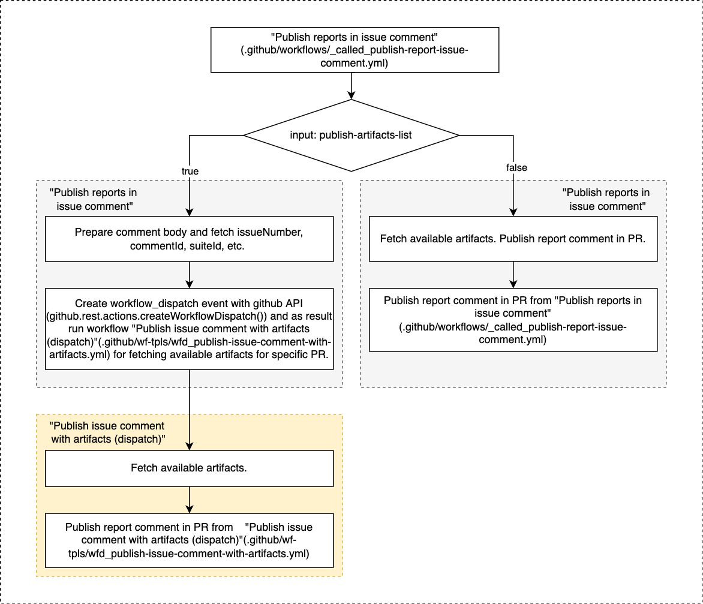

# Basilisk UI CI/CD

Basilisk-UI GitHub Actions are configured with using ["Reusing workflows"](https://docs.github.com/en/actions/using-workflows/reusing-workflows)
and [GitHub Script](https://github.com/actions/github-script).
We have root workflows which are configured for specific purposes with different 
trigger events (`pull_request`, `push`) and reusable modules/workflows which can be reused in different 
combinations/sequence in root workflow. 

---

### Used actions/libraries
- [GitHub Script](https://github.com/actions/github-script) - run JavaScript logic in GitHub Actions.
- [Discord for GitHub Actions](https://github.com/Ilshidur/action-discord) - publication messages to Discord channels.
- [code-coverage-action](https://github.com/barecheck/code-coverage-action) - generate/publish testing code coverage reports to PR.


### Files naming/structure convention
- __root workflow file__ - (`.github/workflows/wf_*.yml`) has prefix `wf_`. Consists of reusable 
  workflow calls in different combinations regarding purposes. Should not contain any functionality for 
  building, testing, deployment, etc.
- __dispatched workflow__ - (`.github/workflows/wfd_*.yml`) has prefix `wfd_`. Workflow which is triggering after dispatch event,
  which is created manually or from another workflow via github API. More details [here](https://docs.github.com/en/rest/reference/actions#create-a-workflow-dispatch-event).
_**IMPORTANT** - All updates in such workflow file will be applied only if they pushed into default repository branch (`main | develop`)._
- __reusable workflow file__ - (`.github/workflows/_called_*.yml`) has prefix `_called_`. Contains 
  functionality for specific purpose (application build, unit testing, etc.). Should contain independent piece of full
  workflow, generate artifacts for next steps, publish reports, etc.
- __github scripts root module__ - (`./scripts/ci/github-script-src/*.js`) contains JavaScript logic for GitHub Script action.
- __github scripts imported module__ - (`./scripts/ci/github-script-src/_*.js`) contains JavaScript import modules for GitHub Script action.

---

## Configured root workflows

#### :file_folder: Build Deploy App and Storybook
```yaml
on:
  push:
    branches:
      - 'fix/**'
      - 'feat/**'
      - develop
  pull_request:
    types:
      - opened
    branches:
      - develop
```
Jobs:
- Build App and Storybook (`build-app-storybook`);
- Deploy App&Storybook builds (`deploy-app-storybook-builds`);
- Report issue comment (`report-statuses-issue-comment`);


#### :file_folder: App E2E testing
```yaml
on:
  push:
    branches:
      - 'fix/**'
      - 'feat/**'
```
Jobs:
- Build App and Storybook (`build-app-storybook`);
- Run App e2e tests (`app-e2e-tests`);

---

## Existing reusing workflows

#### :chains:  Build App and Storybook ([.github/workflows/_called_build.yml](.github/workflows/_called_build.yml))
Build application and storybook. Results are saved as artifacts with passed names.

:inbox_tray: ***Inputs***:
- `app-build-artifact-name`: _String, required_
- `storybook-build-artifact-name`: _String, required_
- `app-node-modules-cache-key`: _String, required_

:outbox_tray: ***Outputs***: -//-

:bricks: ***Artifacts***: Application and Storybook builds with names `app-build-artifact-name` and `storybook-build-artifact-name` 

:lock: ***Secrets***: -//-

<hr />

#### :chains:  Deploy App and Storybook ([.github/workflows/_called_deploy-to-gh-pages.yml](.github/workflows/_called_deploy-to-gh-pages.yml))
Deploy application and storybook to github pages.


This workflow is configured for deployment of UI application and Storybooks
at the same time. Each branch `develop|feat|fix/**` deploys to appropriate folder in `app-builds-gh-pages` branch.
Branch folder contains 2 sub-folders: `app` and `storybook` for UI app and Storybook builds
accordingly.

App UI builds and Storybooks are hosted in GitHub Pages.

For access to the builds you can use these paths:

- **UI app** - `https://galacticcouncil.github.io/Basilisk-ui/<folder_name>/<subfolder_name?>/app`
- **Storybook build** - `https://galacticcouncil.github.io/Basilisk-ui/<folder_name>/<subfolder_name?>/storybook`

:inbox_tray: ***Inputs***:
- `app-build-artifact-name`: _String, required_
- `storybook-build-artifact-name`: _String, required_

:outbox_tray: ***Outputs***: -//-

:bricks: ***Artifacts***: -//-

:lock: ***Secrets***: 
- `gh_token`: _required_
- `gh_pages_full_branch`: _required_ - name of branch for saving deployed builds.

<hr />

#### :chains:  Run unit tests on UI app ([.github/workflows/_called_run-app-unit-tests.yml](.github/workflows/_called_run-app-unit-tests.yml))
Run unit tests in UI application. If trigger event is `pull_request`, workflow builds/tests target branch as well.
Reports can be used in `Publish reports in PR and Discord` workflow for generating code coverage difference value.

:inbox_tray: ***Inputs***:
- `base-branch-codecov-artifact-name`: _String, required_
- `working-branch-codecov-artifact-name`: _String, required_
- `app-node-modules-cache-key`: _String, required_

:outbox_tray: ***Outputs***: -//-

:bricks: ***Artifacts***: Tests code coverage reports (`lcov.info`)with names  
`base-branch-codecov-artifact-name` and `working-branch-codecov-artifact-name`

:lock: ***Secrets***: -//-

<hr />

#### :chains:  Generate tests code coverage reports ([.github/workflows/_called_generate-unit-tests-code-cov-report.yml](.github/workflows/_called_generate-unit-tests-code-cov-report.yml))
Generate unit tests code coverage report from report files, which must be provided as artifacts and names of artifacts as 
workflow inputs.

:inbox_tray: ***Inputs***:
- `base-branch-codecov-artifact-name`: **String, required** - _artifact name with code-coverage report from PR target branch_
- `working-branch-codecov-artifact-name`: **String, required** - _artifact name with code-coverage report from working target branch_

:outbox_tray: ***Outputs***: 
- `codecov_unit_percentage`: _Total Percentage coverage_
- `codecov_unit_diff`: _Percentage difference between head branch_

:bricks: ***Artifacts***: -//-

:lock: ***Secrets***:
- `barecheck_github_app_token`: _required_

<hr />

#### :chains:  Publish reports in Discord ([.github/workflows/_called_publish-report-discord.yml](.github/workflows/_called_publish-report-discord.yml))
Publish statuses and reports from different steps of root workflow in Discord channel. Workflow is based on libraries
`GitHub Script`, `Discord for GitHub Actions`.

:inbox_tray: ***Inputs***:
- `app-build-pub-in-discord`: **Boolean, required** - _publish application build status in Discord channel_
- `app-build-status`: **Boolean** - _is application build successful_
- `app-sb-deploy-pub-report-in-discord`: **Boolean, required** - _publish application and Storybook in Discord channel_
- `app-sb-deploy-status`: **Boolean** - _is application and storybook deployment successful_
- `app-unit-test-pub-report-in-discord`: **Boolean** - _publish application unit tests report in Discord channel_
- `app-unit-test-status`: **Boolean** - _is application unit testing successful_
- `app-unit-test-codecov-percentage`: **String** - _Total Percentage coverage_
- `app-unit-test-codecov-diff`: **String** - _Percentage difference between head branch_

:outbox_tray: ***Outputs***: -//-

:bricks: ***Artifacts***: -//-

:lock: ***Secrets***:
- `gh_pages_full_branch`: _required_
- `discord_alert_ui_web_hook`: _required_

<hr />

### :chains:  Report status in issue ([.github/workflows/_called_report-status-in-issue.yml](.github/workflows/_called_report-in-issue.yml))
Publish statuses and reports from different steps of root workflow as comment in related PR. Workflow is based on libraries
`GitHub Script`. If we need fetch available artifacts, so it can be done only in separate/next workflow run after workflow run
which generates these artifacts. Artifacts are not visible for API before run is completed. More details in 
[this](https://github.com/actions/upload-artifact/issues/50) issue. As result current called workflow has logic, 
explained in diagram below:




:inbox_tray: ***Inputs***:
- `publish-artifacts-list`: **Boolean, required** - _publish available artifacts list. Needs automatic run of dispatched workflow_
- `report-msg-title`: **String, required** - _Title for comment post. This title will be used for matching comment in next
workflow runs for update the comment_
- `app-build-pub-report`: **Boolean, required** - _publish application build status_
- `app-build-status`: **Boolean** - _is application build successful_
- `app-sb-deploy-pub-report`: **Boolean, required** - _publish application and Storybook_
- `app-sb-deploy-status`: **Boolean** - _is application and storybook deployment successful_
- `app-unit-test-pub-report`: **Boolean** - _publish application unit tests report in related PR_
- `app-unit-test-status`: **Boolean** - _is application unit testing successful_
- `app-unit-test-codecov-percentage`: **String** - _Total Percentage coverage_
- `app-unit-test-codecov-diff`: **String** - _Percentage difference between head branch_

:outbox_tray: ***Outputs***: -//-

:bricks: ***Artifacts***: -//-

:lock: ***Secrets***:
- `gh_token`: _required_
- `gh_pages_full_branch`: _required_ 
- `gh_pages_custom_domain`: _required_ - we need save custom GH Pages domain as [this](https://octokit.github.io/rest.js/v18#repos-get-pages) API doesn't provide such data 

<hr />

# FAQ

#### Workflow level `env` variables
We cannot use `env` variables in workflow level because of [this](https://github.com/actions/runner/issues/480) issue.